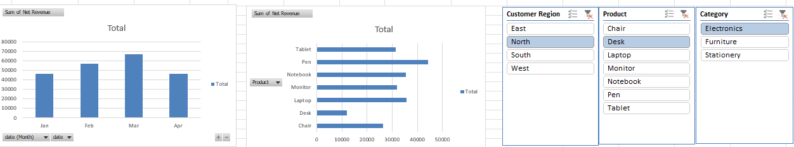

# 🧾 Sales Data Analysis Capstone Project (Excel)

## 📊 Project Overview
This project is a capstone analysis focused on real-world **sales data**, using Microsoft Excel to extract insights, track performance, and visualize key metrics. It demonstrates proficiency in data cleaning, transformation, and dashboard creation.

## 🧠 Objective
To analyze sales performance data and generate actionable insights through Excel dashboards and pivot tables.

## 📁 Files Included
- `Excel_Capstone_Project.xlsx` — The main Excel workbook with:
  - Raw sales data
  - Cleaned and formatted data
  - Pivot tables and charts
  - A fully interactive sales dashboard
- `dashboard.png` — Image preview of the sales performance dashboard.

## 📌 Key Features
- Sales KPIs: Total Revenue, Profit, Quantity Sold, Discounts
- Region-wise, Product-wise, and Category-wise breakdown
- PivotTables for dynamic summarization
- Interactive slicers for time-based filtering
- Clear data visuals for executive reporting

## 🛠 Tools Used
- **Microsoft Excel**
  - Pivot Tables
  - Pivot Charts
  - Slicers and Timelines
  - Conditional Formatting
  - Lookup & Logical Functions

## 🚀 How to Run
1. Download and open `Excel_Capstone_Project.xlsx` in Microsoft Excel.
2. Navigate through the sheets to explore:
   - Raw Data
   - Cleaned Data
   - Sales Dashboard
3. Interact with slicers to filter by region, date, product, etc.

## 📸 Dashboard Preview

## 💡 Insights Generated
- Identification of top-performing regions and products
- Seasonal trends in sales and profit
- Impact of discounts on profit margins
- Sales distribution by customer segment

## 📬 Contact
For suggestions, collaborations, or queries:

> Created by **Konatham Chandrasekhar Reddy  G7 DS**
